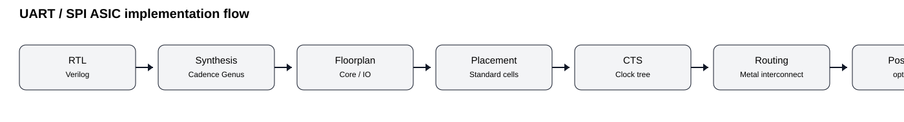
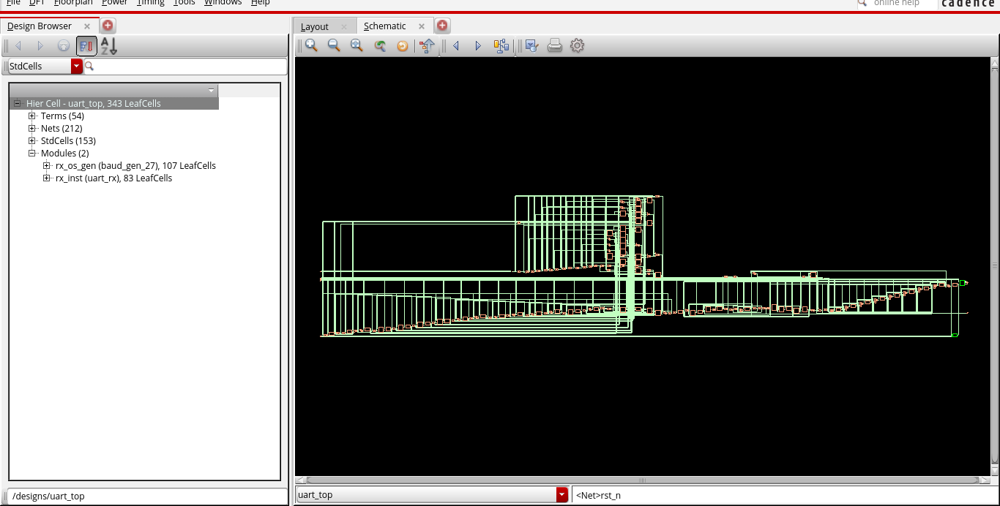
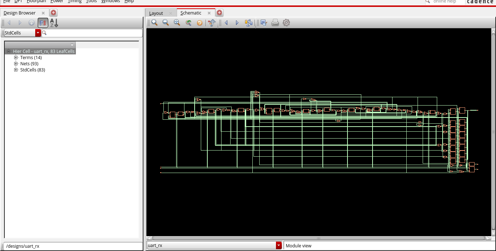
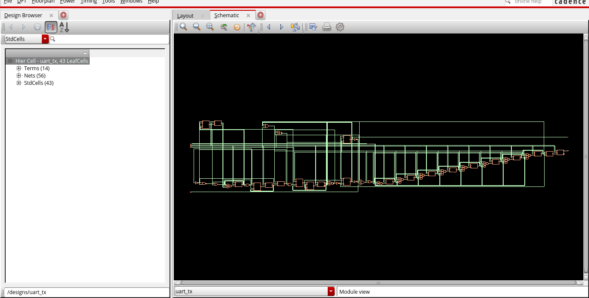
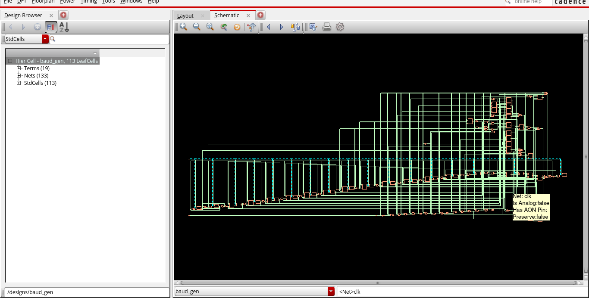

# UART + SPI ASIC Physical Design

> **SCL Internship · Cadence Genus + Innovus · 180 nm ASIC implementation**

A public, interview-oriented record of ASIC synthesis and physical-design work on two communication-controller designs: a **configurable UART** and a **configurable SPI master**.

The designs are intentionally separated into [`uart/`](uart/) and [`spi/`](spi/). Evidence-backed implementation results are kept distinct from reconstructed reference automation.

## Project snapshot

| Design | Genus power | Innovus instances | Innovus area | Innovus power |
|---|---:|---:|---:|---:|
| UART | `7.39923e-05 W` | `339` | `9994.432` | `0.57686031`* |
| SPI | `3.60721e-04 W` | `237` | `6043.072` | `0.41032857`* |

`*` The supplied report excerpt does not explicitly state the Innovus power unit; values are preserved exactly without conversion.

## What this repository demonstrates

- Cadence Genus RTL-to-gate synthesis methodology
- Cadence Innovus physical implementation
- Floorplanning and power planning concepts
- Placement
- Clock-tree synthesis
- Routing
- Post-route optimization
- I/O pad-ring integration for UART
- Area/power analysis
- DRC/GDSII flow understanding
- Professional handling of missing or proprietary implementation artifacts



## UART

### Design

The SCL report describes a full-duplex configurable UART composed of:

- transmitter
- receiver
- programmable baud-rate generation
- receiver oversampling
- frame-error detection

The supplied public source tree retains the UART core RTL modules; the PDK-specific chip wrapper is intentionally omitted:

```text
uart/rtl/
├── uart_top.v
├── uart_tx.v
├── uart_rx.v
└── baud_gen.v
```

### Implementation flow

The report documents functional verification followed by Genus synthesis and two Innovus configurations:

1. UART core without I/O pads
2. UART with I/O pad cells for chip-level implementation

Both configurations are described as undergoing CTS and post-route optimization, followed by DRC and GDSII preparation.

### UART results

| Metric | Reported value |
|---|---:|
| Genus technology library | `tsl18fs120_scl_ss_1` |
| Genus total power | `7.39923e-05 W` |
| Innovus instances | `339` |
| Innovus area | `9994.432` |
| Innovus total power | `0.57686031` |
| IO pads | `65` |

Detailed source-derived report blocks: [`reports/uart/`](reports/uart/).

### UART pad ring

The supplied chip-level IO definition contains **65 pads**:

| Pad cell | Count |
|---|---:|
| `pc3d21` | 3 |
| `pc3o02` | 11 |
| `pc3b02` | 40 |
| `pvdc` | 5 |
| `pv0c` | 6 |
| **Total** | **65** |

The raw `.io` file and PDK IO LEF are intentionally not published. See [`reports/uart/io_pad_ring.md`](reports/uart/io_pad_ring.md).

### UART implementation evidence


*Cadence Innovus chip-level UART pad-ring view; screenshot sanitized to remove the workstation title-bar path.*




### UART RTL / verification evidence








## SPI

### Design

The SCL report describes the SPI master as a configurable synchronous serial controller with:

- serial-clock generation
- finite-state machine
- shift register
- bit counter
- programmable clock divider
- CPOL/CPHA mode support
- full-duplex MOSI/MISO transfer

### Implementation flow

The report documents:

```text
RTL
 ↓
Cadence Genus synthesis
 ↓
Floorplanning
 ↓
Placement
 ↓
CTS
 ↓
Routing
 ↓
Post-route optimization
 ↓
Area / power analysis
 ↓
GDSII preparation
```

### SPI results

| Metric | Reported value |
|---|---:|
| Genus technology library | `tsl18fs120_scl_ss_1` |
| Genus total power | `3.60721e-04 W` |
| Innovus instances | `237` |
| Innovus area | `6043.072` |
| Innovus total power | `0.41032857` |

Detailed report evidence: [`reports/spi/implementation_results.md`](reports/spi/implementation_results.md).

### SPI source availability

The current supplied source package does **not** contain the SPI RTL or the original SPI implementation TCL. Therefore this repository does not fabricate an SPI RTL tree or claim that a reconstructed script was the original script.

The architecture and measured implementation results are retained because they are explicitly documented in the SCL internship report.

## Physical-design debug playbook

[`docs/physical_design_debug_playbook.md`](docs/physical_design_debug_playbook.md) provides the reconstructed Innovus debug/signoff command sequence for interview discussion.

## Cadence flow scripts

The scripts in [`scripts/`](scripts/) are **reconstructed reference flows** based on the methodology documented in the internship report and standard Cadence command structure. They are not claimed to be the original SCL scripts.

### Genus sequence

```text
read_hdl → elaborate → constraints → check_design
        → syn_generic/syn_map/syn_opt
        → report_timing/report_area/report_power
        → write_hdl/write_sdc
```

### Innovus sequence

```text
init_design
→ floorPlan / power planning
→ placeDesign
→ optDesign -preCTS
→ ccopt_design
→ optDesign -postCTS
→ routeDesign
→ optDesign -postRoute
→ verify_drc / verifyConnectivity
→ timing / area / power
→ streamOut
```

These commands are presented as a reproducible engineering model, not as a claim about exact historical command ordering.

## Timing and signoff status

The supplied UART/SPI report sections do not provide clean numerical WNS/TNS/setup/hold values suitable for publication.

| Design | WNS | TNS | Setup/Hold | LVS |
|---|---|---|---|---|
| UART | Not available | Not available | Not available | Not available |
| SPI | Not available | Not available | Not available | Not available |

The report documents DRC and GDSII preparation as implementation stages, but no clean design-specific numerical DRC/LVS result is published here.

## Repository structure

```text
uart-spi-asic-physical-design/
├── README.md
├── uart/
│   ├── rtl/
│   ├── constraints/
│   ├── scripts/
│   ├── reports/
│   └── results/
├── spi/
│   ├── rtl/
│   ├── constraints/
│   ├── scripts/
│   ├── reports/
│   └── results/
├── scripts/
├── docs/
└── images/
```

## Reproduction

A complete rerun requires the original SCL technology libraries/PDK, IO library, authorized Cadence installation, timing constraints, implementation database and (for SPI) the missing RTL source. These are not redistributed.

The repository instead provides enough documentation and reference TCL to discuss the implementation flow technically during an interview.

## Publication safety

Intentionally omitted:

- SCL PDKs
- standard-cell libraries
- IO LEF / raw IO files
- generated DEF/GDS/database files
- internal SCL paths and hostnames
- SPI RTL that was not supplied

See [`docs/publication_audit.md`](docs/publication_audit.md).

